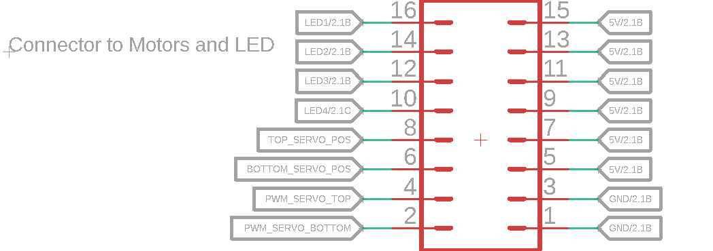

# Moving Head

## Pinout

## Protocol
Length is 3 bytes, command byte followed by two value bytes  
| command | value(high) | value(low)|

### Example
Set led_0 brightness to 100%  
Bytes to send: 0x70 0x00 0x64

## State select
|Command | State|
|--------|------|
|0x91 | Manual movement|
|0x92 | Position regulation|

## Manual movement
|Command | Value | Action |
|--------|-------|--------|
|0x41 | 0x00 | move bottom servo clockwise|
|0x42 | 0x00 | move bottom servo anticlockwise|
|0x45 | 0x01 ... 0x10 | set bottom servo speed [1 - 10]|
|0x51 | 0x00 | move top servo anticlockwise|
|0x52 | 0x00 | move top servo clockwise|
|0x70 | 0x00 ... 0x64 | set led_0 brightness [0 - 100 %]|
|0x71 | 0x00 ... 0x64 | set led_1 brightness [0 - 100 %]|
|0x72 | 0x00 ... 0x64 | set led_2 brightness [0 - 100 %]|
|0x73 | 0x00 ... 0x64 | set led_3 brightness [0 - 100 %]|
|0x90 | 0x00 | stop bottom servo|

## Position regulation
|Command | Value | Action|
|--------|-------|--------|
|0x60 | 0x00 ... 0x168 | move bottom servo to position [0 - 360°]|
|0x61 | 0x00 ... 0xB4 | move top servo to position [0 - 180°]|
|0x70 | 0x00 ... 0x64 | set led_0 brightness [0 - 100 %]|
|0x71 | 0x00 ... 0x64 | set led_1 brightness [0 - 100 %]|
|0x72 | 0x00 ... 0x64 | set led_2 brightness [0 - 100 %]|
|0x73 | 0x00 ... 0x64 | set led_3 brightness [0 - 100 %]|
